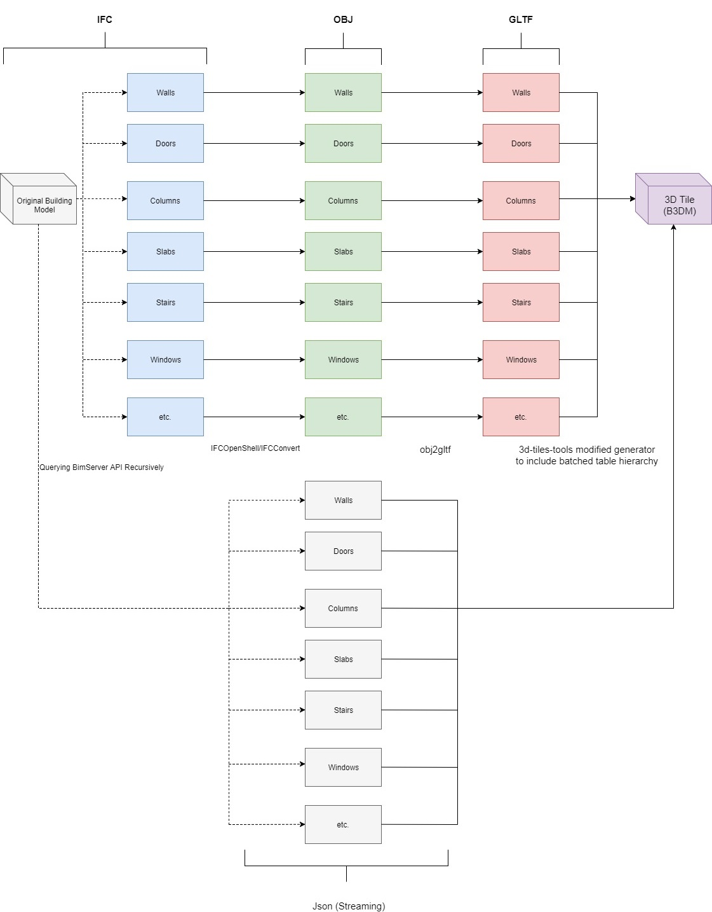

# IFC2B3DM

The converter is designed to ultimately convert an IFC file to B3DM to enable object selection and BIM (Building Information Management) in Cesium.

The converter uses the following architecture as can be seen from the diagram:

BimServer API is used to download an IFC file for each constituent component of the model by recursively sending queries based on oids and ifc types obtained from the json file of the ifc model.
Each ifc file is then converted to OBJ using IfcConvert and then to GLTF using obj2gltf. Finally, 3d-tiles-tools sample generator has been modified to generate the
b3dm file with a batch table hierarchy from the gltfs and json (straming) files, compatible to Cesium. The links to each of these tools can be found below.

# Credits

This repository has been created at CSDILA (Centre for Spatial Data Infrastructres and Land Administration) at the University of Melbourne.

The following open-source tools have been used in the scripts:

--BimServer API: 

https://github.com/opensourceBIM/BIMserver

--IfcOpenShell IFC2X3 IfcConvert 0.5.0-dev: 

http://ifcopenshell.org/ifcconvert.html

https://github.com/IfcOpenShell/IfcOpenShell
                                            
--obj2gltf: 

https://github.com/AnalyticalGraphicsInc/obj2gltf

--3d-tiles-tools sample generator: 

https://github.com/AnalyticalGraphicsInc/3d-tiles-tools

